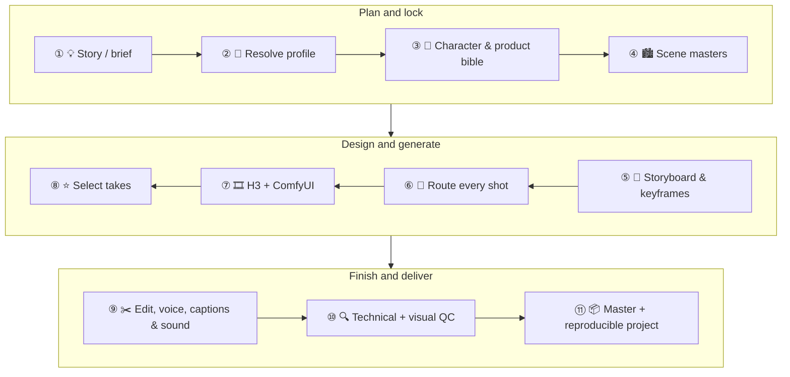

<p align="center">
  <a href="README_zh.md">简体中文</a> ·
  <a href="docs/skill-config.md">⚙️ Skill configuration</a> ·
  <a href="examples/README.md">🎬 Example Gallery</a> ·
  <a href="docs/turbo-vs-standard.md">⚡ Turbo Report</a>
</p>

<p align="center">
  
</p>

<h1 align="center">🎬 MiniMax-H3 Drama</h1>

<p align="center">
  <strong>Turn a story, campaign brief, or reference pack into a finished drama video—inside Codex.</strong><br>
  👤 Character design · 🏙️ Scene design · 🧩 Storyboards · 🎞️ MiniMax H3 video · ✂️ Post-production · ✅ QC
</p>

<p align="center">
  <code>Codex Plugin</code> · <code>MiniMax H3</code> · <code>GPT-Image</code> · <code>ComfyUI</code> · <code>FFmpeg</code>
</p>

MiniMax-H3 Drama is a **Codex-first video production plugin**, not just a prompt collection. Codex plans the production, creates reusable visual sources of truth, routes every shot to the right MiniMax H3 workflow, monitors local ComfyUI, and delivers a resumable project with picture, sound, captions, and QC.

## ✨ Why creators use it

| Highlight | What you get |
|---|---|
| 🎭 **A complete production, not one clip** | Brief → character/product bible → scene masters → storyboard → keyframes → shots → master |
| 🧬 **Cross-shot consistency** | Identity, wardrobe, product geometry, locations, props, screen direction, light, and audio are tracked explicitly |
| 🧠 **Profile-driven direction** | Built-in short-drama and commercial grammar, plus reusable profiles distilled from your own reference videos |
| 🛠️ **Local, deterministic finishing** | Official H3 workflows through local ComfyUI; versioned FFmpeg editing, mixing, captions, exports, and QC |
| ⚡ **Turbo by default** | T2V, I2V, and R2V use the MiniMax H3 Turbo LoRA at 6 steps; `[turbo=false]` keeps the original 20-step graphs available |
| 🔁 **Resumable by design** | Every prompt, input hash, workflow, `prompt_id`, take, selection, assumption, and artifact stays in the project ledger |

<p align="center">
  
</p>

<p align="center"><em>From a natural-language request and references to a returned video without leaving the Codex task.</em></p>

<p align="center"><strong><a href="examples/README.md">See More Drama Examples in Gallery</a></strong></p>

## 🚀 Quick start

### 1. Install for Codex

This repository publishes two Codex plugins from one marketplace: the nine-skill production plugin with a pinned local ComfyUI MCP connection, plus the separate `h3style` companion containing the official MiniMax-H3 skills. Install the production plugin, then add the official style companion when you want those workflows:

```bash
codex plugin marketplace add chiphoton/MiniMax-H3-Codex-Drama
codex plugin add minimax-h3-drama@chiphoton
codex plugin add h3style@chiphoton
codex plugin list --json
```

Start a new Codex task after installation so the bundled skills and MCP server are loaded. `h3style` remains a separate plugin namespace, so official skills appear as `h3style:<skill>` and can be refreshed without merging upstream files into the production plugin.

For a skills-only installation:

```bash
npx skills add chiphoton/MiniMax-H3-Codex-Drama --all -g -a codex -y
```

The skills-only route does not install the bundled ComfyUI MCP connection.

The skills-only CLI does not preserve plugin namespaces and may discover the nested `h3style` adapters as ordinary skills. Use the Codex plugin installation above when the `h3style:<skill>` separation matters.

> Migrating from `0.1.x`? Remove the old `minimax-h3-prompt-skills` plugin before installing `minimax-h3-drama` so the specialist skills are not registered twice.

### 2. Prepare the local runtime

Install Node.js and npm: the plugin launches the pinned `comfyui-mcp@0.49.3` package through `npx`, and its first launch may need network access to populate the npm cache. Run ComfyUI at `http://localhost:8188` with compatible MiniMax H3 models and nodes. Install FFmpeg/FFprobe for assembly and QC.

Turbo is enabled by default. Install [ComfyUI-MiniMax-H3-Turbo](https://github.com/Larryvrh/ComfyUI-MiniMax-H3-Turbo) through ComfyUI-Manager (search **MiniMax-H3 Turbo**) or under `ComfyUI/custom_nodes/`, restart ComfyUI, and place `minimax_h3_turbo_v4_step600_ema.safetensors` from the [Turbo LoRA repository](https://huggingface.co/larryvrh/MiniMax-H3-Turbo-Lora) in `ComfyUI/models/loras/`. Use `[turbo=false]` for the original workflow when those Turbo dependencies are intentionally unavailable.

The plugin checks the environment before expensive work; it does **not** silently download models, install ComfyUI nodes, start services, or restart ComfyUI.

### 3. Direct your first drama

```text
$minimax-h3-drama-producer
Create a 45-second 9:16 workplace reversal drama from my attached story.
Preserve my characters and dialogue. Design a consistent character sheet and
office scene master, build an 8-shot storyboard, generate every shot, add
captions and sound, and deliver the finished vertical master.
Use the tiktok-short-drama profile. [mode=fast]
```

Remove `[mode=fast]` when you want to approve the production plan and visual lock before generation.

## 🐍 One production, folded into a compact flow



Guided mode pauses after the production plan and again after the visual sources of truth. Fast mode records conservative assumptions and continues automatically.

## 🪄 Representative prompts

<details open>
<summary><strong>🎭 Produce a complete short drama</strong></summary>

```text
$minimax-h3-drama-producer
Turn this script and cast reference pack into a 60-second vertical short drama.
Keep the plot and dialogue unchanged. Design missing locations and shot coverage,
lock character continuity, then finish picture, dialogue, subtitles, music, and QC.
```

</details>

<details>
<summary><strong>🧪 Distill a reusable house style</strong></summary>

```text
$minimax-h3-profile-distiller
Analyze these three local reference videos. Extract their pacing, shot grammar,
camera behavior, caption style, sound pattern, and QC rules into a reusable
profile. Exclude their people, branding, dialogue, plot, and music melody.
```

</details>

<details>
<summary><strong>🎥 Design and run one H3 shot</strong></summary>

```text
$minimax-h3-adviser
Image 1 controls the actor's identity. Video 1 controls only the handheld camera
motion. Create an 8-second tense corridor reveal, then run it in ComfyUI.
[return=true] [load_workflow=true] [preview=true]
```

</details>

See [skill configuration](docs/skill-config.md) for every control flag, configuration file, model override, generation setting, and ready-to-copy combination.

## 🧰 Nine skills, one production system

| | Skill | Role |
|---:|---|---|
| 🎬 | [`minimax-h3-drama-producer`](skills/minimax-h3-drama-producer/SKILL.md) | Produce or resume a complete multi-shot video project |
| 🧪 | [`minimax-h3-profile-distiller`](skills/minimax-h3-profile-distiller/SKILL.md) | Distill local reference videos into a safe, reusable production profile |
| 🧭 | [`minimax-h3-adviser`](skills/minimax-h3-adviser/SKILL.md) | Choose the workflow, improve a prompt, or diagnose a failed result |
| ✍️ | [`minimax-h3-text-to-video`](skills/minimax-h3-text-to-video/SKILL.md) | Invent a complete shot from language |
| 🖼️ | [`minimax-h3-frame-to-video`](skills/minimax-h3-frame-to-video/SKILL.md) | Animate an exact first frame or bridge exact first/last frames |
| 🎛️ | [`minimax-h3-reference-to-video`](skills/minimax-h3-reference-to-video/SKILL.md) | Bind identity, design, style, motion, camera, performance, or audio references |
| ✂️ | [`minimax-h3-video-editor`](skills/minimax-h3-video-editor/SKILL.md) | Make a precise change while stating what must remain unchanged |
| ⚙️ | [`minimax-h3-comfyui`](skills/minimax-h3-comfyui/SKILL.md) | Prepare, validate, submit, monitor, and fetch local H3 workflows |
| 🪄 | [`qwen-image-edit`](skills/qwen-image-edit/SKILL.md) | Run the pinned one/two-reference Qwen consistency-edit workflow |

The Qwen skill is explicit-only. Invoke `$qwen-image-edit` to run an edit, or `$qwen-image-edit help` to show its complete [ComfyUI dependency and model guide](skills/qwen-image-edit/references/comfyui-workflow-install.md). Its default path copies the prompt payload directly into the workflow. All boolean bracket controls share the aliases documented in [skill configuration](docs/skill-config.md).

## 🎨 Official H3 style companion

The separate [`h3style`](plugins/h3style/README.md) plugin pins all nine folders from the official [MiniMax-H3 skills repository](https://github.com/MiniMax-AI/MiniMax-H3/tree/main/skills). Every official source stays unchanged under `references/official/`; thin Codex entrypoints remove unsupported metadata from `h3-prompt-writing` and translate Hub-only operations in the other eight workflows into planning, prompts, approval gates, and handoff to this production plugin.

| Official skill | Best fit |
|---|---|
| [`h3style:h3-prompt-writing`](plugins/h3style/skills/h3-prompt-writing/SKILL.md) | Official structured prompts for base/keyframe and Ref2VA modes |
| [`h3style:3d-animation-short-generator`](plugins/h3style/skills/3d-animation-short-generator/SKILL.md) | Complete stylized 3D animated narratives |
| [`h3style:minimalist-product-ad-generator`](plugins/h3style/skills/minimalist-product-ad-generator/SKILL.md) | Premium minimalist product films |
| [`h3style:papercraft-stop-motion-explainer`](plugins/h3style/skills/papercraft-stop-motion-explainer/SKILL.md) | Layered papercraft and miniature explainers |
| [`h3style:brand-promo-video-generator`](plugins/h3style/skills/brand-promo-video-generator/SKILL.md) | Verified brand, app, website, shop, and launch promos |
| [`h3style:music-video-subtitle-generator`](plugins/h3style/skills/music-video-subtitle-generator/SKILL.md) | Beat- and lyric-driven MVs with spatial typography |
| [`h3style:co-op-game-intro-generator`](plugins/h3style/skills/co-op-game-intro-generator/SKILL.md) | Two-player game menus and opening animations |
| [`h3style:paper-collage-explainer-generator`](plugins/h3style/skills/paper-collage-explainer-generator/SKILL.md) | Halftone editorial paper-collage explainers |
| [`h3style:handdrawn-live-video-generator`](plugins/h3style/skills/handdrawn-live-video-generator/SKILL.md) | Live action fused with rough glowing hand-drawn motion |

The adviser selects at most one matching official style overlay, then still chooses the correct local H3 input route. Refresh the pinned official snapshot with `python3 plugins/h3style/scripts/sync_upstream.py`; provenance and per-skill hashes are recorded in [`upstream-lock.json`](plugins/h3style/upstream-lock.json).

## 🔄 Compare and update installed skills

The project-level manager inventories deterministic skill hashes, compares the `skills/` tree between Git refs, and previews plugin update commands before applying them:

```bash
python3 scripts/manage_skills.py list
python3 scripts/manage_skills.py diff v0.3.0 v0.4.0
python3 scripts/manage_skills.py update
python3 scripts/manage_skills.py update --apply
```

`update` is a dry run unless `--apply` is explicit. Start a new Codex task after updating so the refreshed plugin skills load.

## 🎨 Make visual direction concrete

The adviser can show visual atlases so “cinematic” becomes a controllable choice instead of a vague style word.

<table>
  <tr>
    <td align="center"><strong>📐 Framing</strong><br></td>
    <td align="center"><strong>🎥 Camera motion</strong><br></td>
    <td align="center"><strong>💡 Lighting</strong><br></td>
  </tr>
</table>

The generated MiniMax H3 prompt remains text-only; the atlases are conversation aids.

## 🎚️ Built-in production profiles

Profiles are declarative data, never executable code:

```text
base-video + one primary profile + explicit user overrides
```

| Profile | Best for | Signature defaults |
|---|---|---|
| `tiktok-short-drama` | Conflict, emotion, reveal, payoff | 9:16, hook-first pacing, shot keyframes, captions on |
| `commercial-ad` | Promise, proof, product hero, CTA | 16:9 master, product geometry locks, deterministic brand text |

Use `minimax-h3-profile-distiller` to learn a new production grammar from local references without copying their source-specific content.

## 📦 Reproducible output

```text
outputs/<project>/
├── planning/ + profile/ + prompts/ + images/
├── workflows/ + clips/ + audio/ + subtitles/
├── edit/ + qc/ + final/ + logs/
└── project.yaml
```

Re-running the same project resumes completed work and versions new attempts instead of erasing history. A successful delivery includes the local master, media info, contact sheet, technical/visual QC report, timeline, and reproducible export instructions.

## 🔌 Notes

- Official pinned T2V, I2V, and R2V graphs are prepared deterministically; arbitrary custom workflow adaptation is intentionally out of scope.
- Voice and captions can be `auto`, `on`, or `off`. No paid voice service is called silently.
- FFmpeg is the v1 editing backend; selected clips, audio stems, captions, and timeline data remain available for manual NLE import.
- Prompt-only Open WebUI editions remain in [`adapter/open-webui`](adapter/open-webui/). The producer and profile distiller are Codex-specific.

---

<p align="center">
  <strong>Bring the story. Let Codex build the production system around it. 🎬</strong>
</p>
