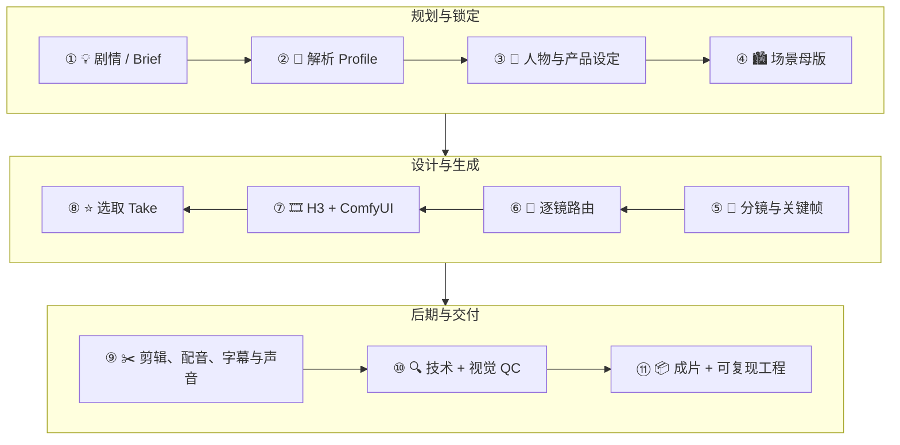

<p align="center">
  <a href="README.md">English</a> ·
  <a href="docs/skill-config.md">⚙️ 技能参数配置</a> ·
  <a href="examples/README_zh.md">🎬 示例画廊</a> ·
  <a href="docs/turbo-vs-standard.md">⚡ Turbo 对比报告</a>
</p>

<p align="center">
  
</p>

<h1 align="center">🎬 MiniMax-H3 Drama</h1>

<p align="center">
  <strong>把剧情、广告 brief 或参考素材，直接在 Codex 中制作成完整剧情视频。</strong><br>
  👤 人物设计 · 🏙️ 场景设计 · 🧩 分镜设计 · 🎞️ MiniMax H3 视频生成 · ✂️ 后期制作 · ✅ 质量检查
</p>

<p align="center">
  <code>Codex Plugin</code> · <code>MiniMax H3</code> · <code>GPT-Image</code> · <code>ComfyUI</code> · <code>FFmpeg</code>
</p>

MiniMax-H3 Drama 是一套 **Codex 优先的视频与原生音频制作插件**，不只是提示词合集。Codex 会规划制作、建立可复用的视觉基准、为每个镜头或纯音频片段选择合适的 MiniMax H3 工作流、监控本地 ComfyUI，并交付包含画面、声音、字幕和 QC 的可续作媒体工程。

## ✨ 为什么值得用

| 亮点 | 你会得到什么 |
|---|---|
| 🎭 **制作整支视频，而不只是单个片段** | 需求 → 人物/产品设定 → 场景母版 → 分镜 → 关键帧 → 镜头 → 成片 |
| 🧬 **跨镜头一致性** | 显式追踪人物身份、服装、产品结构、场景、道具、轴线、光线和声音 |
| 🧠 **Profile 驱动的导演方法** | 内置短剧与广告语法，也能从你自己的参考视频中提炼可复用 Profile |
| 🛠️ **本地、确定性的后期** | 本地 ComfyUI 官方 H3 工作流；版本化 FFmpeg 剪辑、混音、字幕、导出和 QC |
| ⚡ **默认启用 Turbo** | T2V、I2V、R2V 与纯音频生成默认使用 6 步 MiniMax H3 Turbo LoRA；`[turbo=false]` 可切回原始 20 步工作流 |
| 🔁 **天然支持断点续作** | 提示词、输入哈希、工作流、`prompt_id`、take、选片、假设和资产全部进入工程账本 |

<p align="center">
  
</p>

<p align="center"><em>从一句自然语言指令和参考素材，到 Codex 任务中直接返回视频。</em></p>

<p align="center"><strong><a href="examples/README_zh.md">在示例画廊查看更多剧情案例</a></strong></p>

## 🚀 快速开始

### 1. 安装到 Codex

本仓库在同一个市场中提供两个 Codex 插件：包含 10 个技能与固定版本本地 ComfyUI MCP 连接的制作插件，以及独立的官方技能伴侣 `h3style`。先安装制作插件；如需官方工作流，再安装风格伴侣：

```bash
codex plugin marketplace add chiphoton/MiniMax-H3-Codex-Drama
codex plugin add minimax-h3-drama@chiphoton
codex plugin add h3style@chiphoton
codex plugin list --json
```

安装完成后请新建一个 Codex 任务，以加载插件内的技能和 MCP 服务。`h3style` 使用独立插件命名空间，因此官方技能会显示为 `h3style:<skill>`，上游更新不会混入制作插件的技能目录。

如果只需安装技能：

```bash
npx skills add chiphoton/MiniMax-H3-Codex-Drama --all -g -a codex -y
```

仅安装技能不会安装插件内置的 ComfyUI MCP 连接。

仅技能 CLI 不会保留插件命名空间，并可能把嵌套的 `h3style` 适配器识别为普通技能。如果需要保持 `h3style:<skill>` 的独立命名空间，请使用上面的 Codex 插件安装方式。

> 从 `0.1.x` 升级？请先移除旧的 `minimax-h3-prompt-skills` 插件，再安装 `minimax-h3-drama`，避免同名专业技能被注册两次。

### 2. 准备本地运行环境

请先安装 Node.js 和 npm：插件会通过 `npx` 启动固定版本的 `comfyui-mcp@0.49.3`，首次启动时可能需要联网以填充 npm 缓存。在 `http://localhost:8188` 运行 ComfyUI，并准备兼容的 MiniMax H3 模型与节点；安装 FFmpeg/FFprobe 以完成剪辑和 QC。

Turbo 默认启用。请通过 ComfyUI-Manager 搜索并安装 **MiniMax-H3 Turbo**，或把 [ComfyUI-MiniMax-H3-Turbo](https://github.com/Larryvrh/ComfyUI-MiniMax-H3-Turbo) 放入 `ComfyUI/custom_nodes/`，随后重启 ComfyUI；再从 [Turbo LoRA 仓库](https://huggingface.co/larryvrh/MiniMax-H3-Turbo-Lora) 下载 `minimax_h3_turbo_v4_step600_ema.safetensors` 并放入 `ComfyUI/models/loras/`。如果有意不安装这些依赖，可使用 `[turbo=false]` 切回原始工作流。

插件会在昂贵操作之前做环境检查，但**不会**静默下载模型、安装 ComfyUI 节点、启动服务或重启 ComfyUI。

### 3. 导演你的第一支短剧

```text
$minimax-h3-drama-producer
根据我附带的故事制作一支 45 秒、9:16 的职场反转短剧。
保留原有人物与对白。设计统一的人物设定表和办公室场景母版，制作 8 镜分镜，
生成全部镜头，加入字幕和声音，并交付竖屏成片。
使用 tiktok-short-drama profile。[mode=fast]
```

如果希望在生成前审核制作方案和视觉锁定，请移除 `[mode=fast]`。

## 🐍 一条折叠成蛇形的完整制作流程



引导模式会在制作方案和视觉基准完成后各暂停一次；快速模式会记录保守假设并自动继续。

## 🪄 代表性提示词

<details open>
<summary><strong>🎭 制作一支完整短剧</strong></summary>

```text
$minimax-h3-drama-producer
把这份剧本和演员参考素材制作成 60 秒竖屏短剧。
不要修改剧情和对白；补齐缺失场景与镜头覆盖，锁定人物连续性，
然后完成画面、对白、字幕、音乐和 QC。
```

</details>

<details>
<summary><strong>🧪 提炼可复用的视觉与节奏语法</strong></summary>

```text
$minimax-h3-profile-distiller
分析这三个本地参考视频，把它们的节奏、镜头语法、运镜、字幕样式、
声音模式和 QC 规则提炼成可复用 Profile；排除人物、品牌、对白、剧情和音乐旋律。
```

</details>

<details>
<summary><strong>🎥 设计并运行一个 H3 镜头</strong></summary>

```text
$minimax-h3-adviser
图片 1 只控制演员身份；视频 1 只控制手持运镜。
制作一个 8 秒的紧张走廊揭晓镜头，然后在 ComfyUI 中运行。
[return=true] [load_workflow=true] [preview=true]
```

</details>

所有控制标记、配置文件、模型覆盖、生成参数和可复制组合，详见[技能参数配置](docs/skill-config.md)。

## 🧰 10 个技能，一套制作系统

| | 技能 | 作用 |
|---:|---|---|
| 🎬 | [`minimax-h3-drama-producer`](skills/minimax-h3-drama-producer/SKILL.md) | 制作或续作完整的多镜头视频工程 |
| 🧪 | [`minimax-h3-profile-distiller`](skills/minimax-h3-profile-distiller/SKILL.md) | 从本地参考视频提炼安全、可复用的制作 Profile |
| 🧭 | [`minimax-h3-adviser`](skills/minimax-h3-adviser/SKILL.md) | 选择工作流、优化提示词或诊断失败结果 |
| ✍️ | [`minimax-h3-text-to-video`](skills/minimax-h3-text-to-video/SKILL.md) | 纯文本设计完整镜头 |
| 🔊 | [`minimax-h3-audio`](skills/minimax-h3-audio/SKILL.md) | 以纯提示词生成对白、旁白、环境声、机器人声或动物叫声，并输出原生 FLAC |
| 🖼️ | [`minimax-h3-frame-to-video`](skills/minimax-h3-frame-to-video/SKILL.md) | 动画化精确首帧，或连接精确首尾帧 |
| 🎛️ | [`minimax-h3-reference-to-video`](skills/minimax-h3-reference-to-video/SKILL.md) | 绑定身份、设计、风格、动作、运镜、表演或音频参考 |
| ✂️ | [`minimax-h3-video-editor`](skills/minimax-h3-video-editor/SKILL.md) | 精确描述修改项，并明确必须保持不变的内容 |
| ⚙️ | [`minimax-h3-comfyui`](skills/minimax-h3-comfyui/SKILL.md) | 准备、验证、提交、监控并取回本地 H3 工作流 |
| 🪄 | [`qwen-image-edit`](skills/qwen-image-edit/SKILL.md) | 运行固定的一/双参考图 Qwen 一致性编辑工作流 |

Qwen 技能仅支持显式调用。使用 `$qwen-image-edit` 运行编辑，或使用 `$qwen-image-edit help` 查看完整的 [ComfyUI 节点与模型安装指南](skills/qwen-image-edit/references/comfyui-workflow-install.md)。默认情况下，提示词载荷会原样写入工作流。所有布尔方括号控制项均采用[技能参数配置](docs/skill-config.md)中记录的统一别名。

## 🎨 官方 H3 风格伴侣

独立的 [`h3style`](plugins/h3style/README.md) 插件固定收录官方 [MiniMax-H3 技能仓库](https://github.com/MiniMax-AI/MiniMax-H3/tree/main/skills)中的 9 个技能目录。所有官方原文都原样保存在 `references/official/`；轻量 Codex 入口会移除 `h3-prompt-writing` 中不受支持的元数据，并把其余 8 个工作流的 Hub 专属操作转换为规划、提示词、确认门和制作插件交接。

| 官方技能 | 适用场景 |
|---|---|
| [`h3style:h3-prompt-writing`](plugins/h3style/skills/h3-prompt-writing/SKILL.md) | Base/关键帧与 Ref2VA 的官方结构化提示词 |
| [`h3style:3d-animation-short-generator`](plugins/h3style/skills/3d-animation-short-generator/SKILL.md) | 完整风格化 3D 动画叙事 |
| [`h3style:minimalist-product-ad-generator`](plugins/h3style/skills/minimalist-product-ad-generator/SKILL.md) | 高级极简产品广告 |
| [`h3style:papercraft-stop-motion-explainer`](plugins/h3style/skills/papercraft-stop-motion-explainer/SKILL.md) | 分层纸艺与微缩定格科普 |
| [`h3style:brand-promo-video-generator`](plugins/h3style/skills/brand-promo-video-generator/SKILL.md) | 基于可信事实的品牌、应用、网站与发布宣传 |
| [`h3style:music-video-subtitle-generator`](plugins/h3style/skills/music-video-subtitle-generator/SKILL.md) | 节拍、歌词与空间字体驱动的 MV |
| [`h3style:co-op-game-intro-generator`](plugins/h3style/skills/co-op-game-intro-generator/SKILL.md) | 双人协作游戏菜单与开场动画 |
| [`h3style:paper-collage-explainer-generator`](plugins/h3style/skills/paper-collage-explainer-generator/SKILL.md) | 网点印刷感纸拼贴解说 |
| [`h3style:handdrawn-live-video-generator`](plugins/h3style/skills/handdrawn-live-video-generator/SKILL.md) | 真人空间与粗粝发光手绘动画融合 |

Adviser 最多选择一个匹配的官方风格层，然后仍按素材实际用途选择本地 H3 输入工作流。运行 `python3 plugins/h3style/scripts/sync_upstream.py` 可刷新官方快照；来源 commit 与逐技能哈希记录在 [`upstream-lock.json`](plugins/h3style/upstream-lock.json) 中。

## 🔄 比较并更新已安装技能

项目级管理脚本可以列出确定性的技能哈希、比较两个 Git ref 之间的 `skills/` 变化，并在实际更新插件前预览命令：

```bash
python3 scripts/manage_skills.py list
python3 scripts/manage_skills.py diff v0.3.0 v0.4.0
python3 scripts/manage_skills.py update
python3 scripts/manage_skills.py update --apply
```

`update` 默认为 dry run；只有显式添加 `--apply` 才会修改安装。更新后请新建 Codex 任务，以加载刷新后的插件技能。

## 🎨 把视觉方向变成具体选择

Adviser 可以展示视觉图谱，让“电影感”不再是模糊形容词，而是可控制的创作决定。

<table>
  <tr>
    <td align="center"><strong>📐 景别与构图</strong><br></td>
    <td align="center"><strong>🎥 运镜</strong><br></td>
    <td align="center"><strong>💡 灯光</strong><br></td>
  </tr>
</table>

图谱只用于创作沟通；最终 MiniMax H3 提示词仍然是纯文本。

## 🎚️ 内置制作 Profile

Profile 是声明式数据，不是可执行代码：

```text
base-video + 一个主 Profile + 用户显式覆盖
```

| Profile | 适用场景 | 标志性默认值 |
|---|---|---|
| `tiktok-short-drama` | 冲突、情绪、揭晓、爽点 | 9:16、开头强钩子、逐镜关键帧、默认字幕 |
| `commercial-ad` | 承诺、证据、产品英雄镜头、CTA | 16:9 母版、产品结构锁定、确定性品牌文字 |

使用 `minimax-h3-profile-distiller`，可以从本地参考片中学习新的制作语法，同时排除来源特定内容。

## 📦 可复现的工程交付

```text
outputs/<project>/
├── planning/ + profile/ + prompts/ + images/
├── workflows/ + clips/ + audio/ + subtitles/
├── edit/ + qc/ + final/ + logs/
└── project.yaml
```

再次运行同一工程时，会从已完成阶段继续，并为新尝试创建版本，而不是抹掉历史。成功交付至少包含本地成片、媒体信息、联系表、技术/视觉 QC 报告、时间线和可复现导出说明。

## 🔌 说明

- 固定版本的 T2V、I2V、R2V 图以及已验证的派生纯音频图会被确定性准备；当前版本不适配任意自定义工作流。
- 配音和字幕可设为 `auto`、`on` 或 `off`；不会静默调用付费语音服务。
- v1 使用 FFmpeg 作为剪辑后端；选中片段、音频 stems、字幕和时间线数据均可手动导入 NLE。
- 纯提示词版 Open WebUI 适配器仍位于 [`adapter/open-webui`](adapter/open-webui/)；Producer 和 Profile Distiller 仅面向 Codex。

---

<p align="center">
  <strong>你带来故事，Codex 为它搭起整套制作系统。🎬</strong>
</p>
